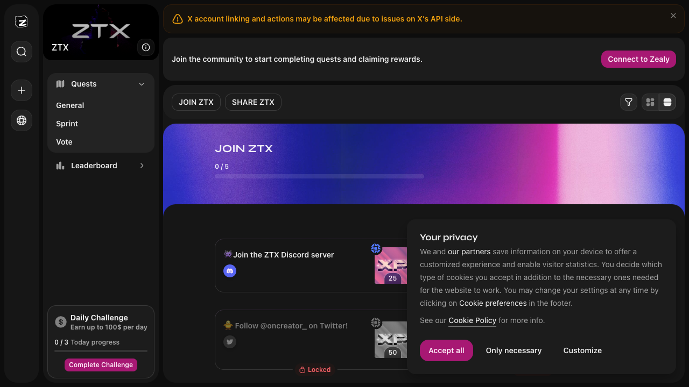
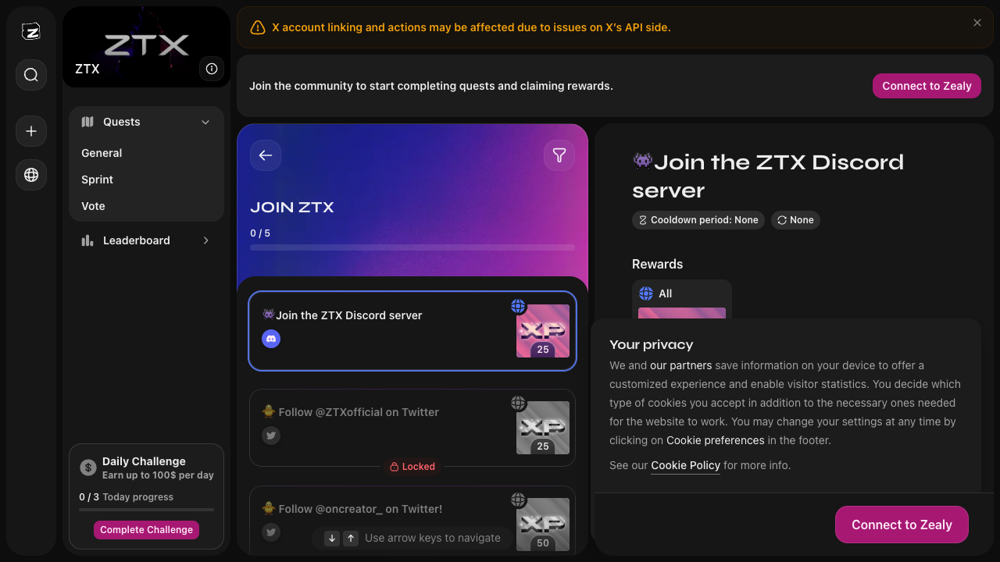
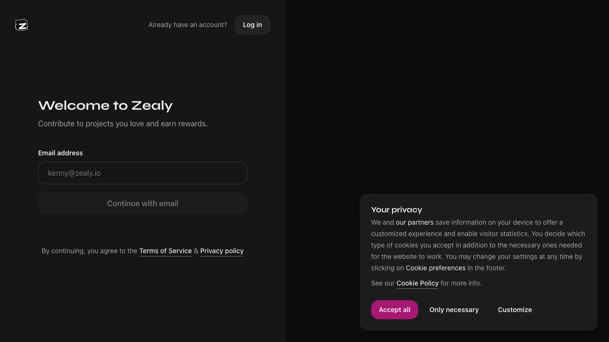
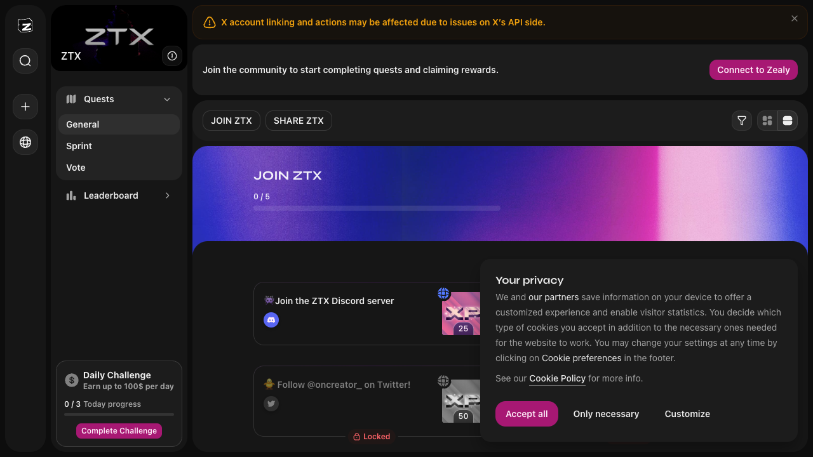
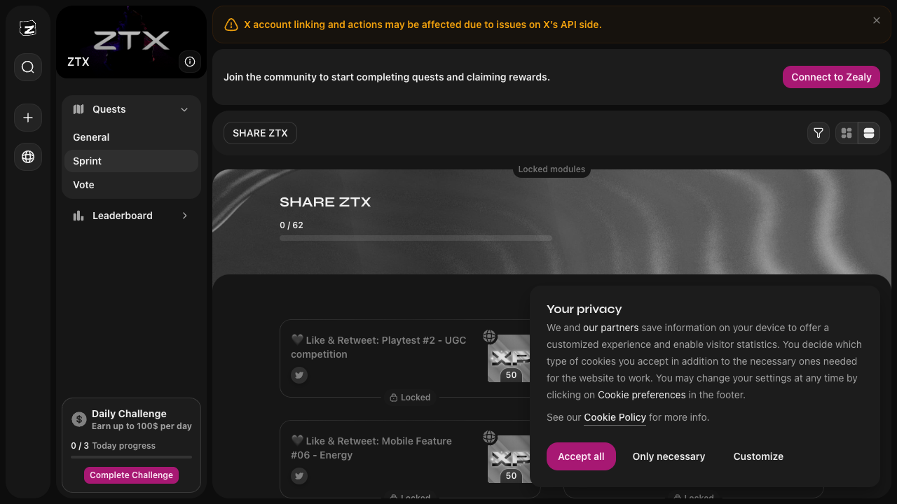
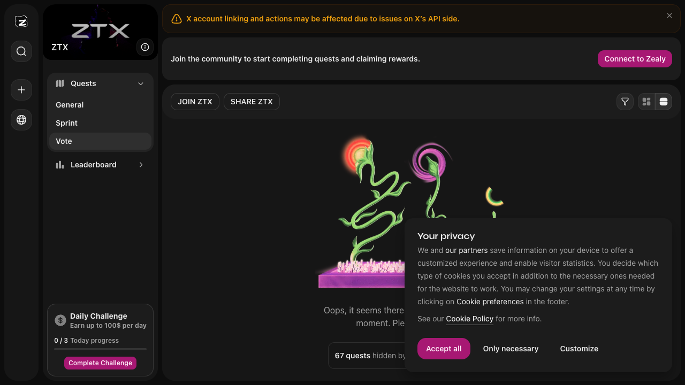

# 🧪 Zealy UI Playwright Test

This repository contains a Playwright-based UI automation test for the [Zealy](https://zealy.io/cw/ztx/questboard/) quest system.

## 📌 Description

The test simulates a user journey through Zealy’s interface, including:

- Opening the main questboard page
- Entering the "Join the ZTX Discord server" mission
- Clicking "Connect to Zealy" and returning via browser back
- Navigating to the `Sprint` tab and verifying the `SHARE ZTX` element
- Navigating to the `Vote` tab and checking for the "no quests" message

Each step captures a screenshot for visual verification.

## 🛠️ Stack

- Playwright
- JavaScript (Node.js)
- Visual Studio Code
- GitHub

## 🧩 Project Structure

```
zealy-ui-playwright-test/
├── tests/
│   └── zealy-ui.spec.js
├── screenshots/
│   └── zealy/
│       ├── step1_main.png
│       ├── step2_mission_open.png
│       ├── step3_connect.png
│       ├── step4_back_to_main.png
│       ├── step5_sprint.png
│       ├── step6_back_to_main_after_sprint.png
│       ├── step7_vote.png
│       └── step8_back_to_main_after_vote.png
├── .gitignore
├── package.json
└── README.md
```

## ✅ How to Run

```bash
npm install
npx playwright test tests/zealy-ui.spec.js
```

> Ensure Chromium is installed via `npx playwright install` if not already available.


## 📸 Screenshots

### Step 1 – Main Page


### Step 2 – Mission Open


### Step 3 – Connect to Zealy


### Step 4 – Back to Main


### Step 5 – Sprint Tab


### Step 6 – Back to Main After Sprint


### Step 7 – Vote Tab


### Step 8 – Back to Main After Vote


---

This project was created as part of a QA portfolio to demonstrate UI automation skills using Playwright.
